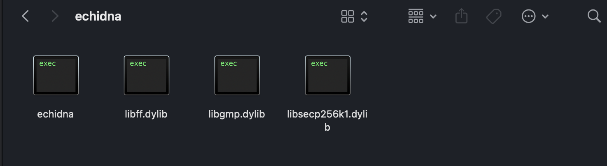
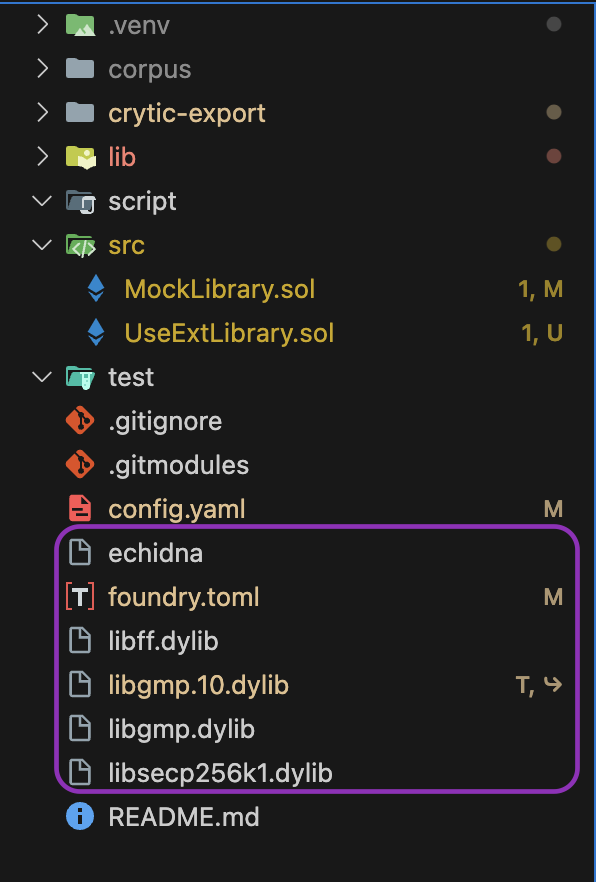
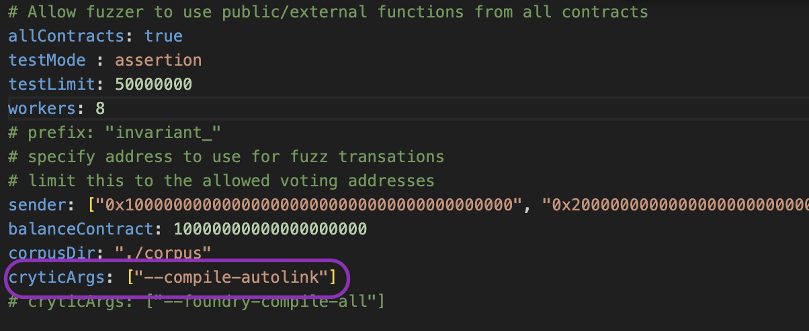
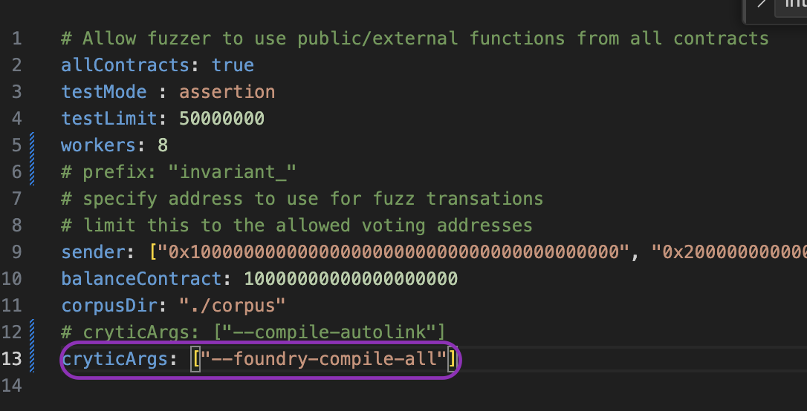

# Echidna Autolink Feature Testing Report

---

## 1. Installation & Setup

- Installed the zip file: `echidna-macos`

- Extracted the 4 required files and placed them in the root folder of the project I was testing

- Activated the virtual environment (`venv`) in the terminal

---

## 2. Smart Contract Under Test

- Wrote a simple smart contract with an **intentional bug**
- Added an **invariant** using Echidna designed to detect the bug

---

## 3. Test Matrix (4 Scenarios)

I tested the same contract using different combinations of:

- **Library Visibility:** `internal` vs `external`
- **Compiler Used:** `autolink` vs `foundry` (via `--cryticArgs`)

---

### A. Using `--cryticArgs` with Autolink Compilation

#### Library marked as `external`

- ✅ **Compiled successfully**
- ❌ **Bug not detected**
- **Observation:**  
  In the image below, we can see that Autolink compiled the project successfully, but something appears off with the bug detection for external libraries. Echidna shows a passing status in the terminal, even though a bug was intentionally introduced.
  

#### Library marked as `internal`

- ✅ **Compiled successfully**
- ✅ **Bug detected instantly**
- **Observation:**  
  With the library marked as `internal`, Autolink compilation worked as expected. Echidna detected the bug within a split second, confirming that everything functioned properly in this configuration.
  

---

### B. Using `--cryticArgs` with Foundry Compilation

#### Library marked as `external`

- ❌ **Compilation failed**
- **Observation:**  
  As seen in the image, Foundry failed to compile when the library was marked as external. This is expected behavior — Foundry doesn’t support compiling external libraries directly.  
  It also supports the earlier observation that Autolink *was* compiling external libraries — albeit with a bug in detection.
  

#### Library marked as `internal`

- ✅ **Compiled successfully**
- ✅ **Bug detected**
- **Observation:**  
  In this configuration, Foundry compiled the contract correctly and Echidna was able to detect the intentional bug. This matched the behavior we observed with Autolink + internal libraries.
  

---

## 4. Summary of Findings

- ✅ **Autolink** works correctly with **internal libraries** — compiles and detects the bug
- ❌ **Autolink** compiles **external libraries**, but **fails to detect** the bug.
- ✅ **Foundry** cannot compile **external libraries** — expected limitation
- ✅ **Foundry** compiles **internal libraries** and **successfully detects bugs**

---
